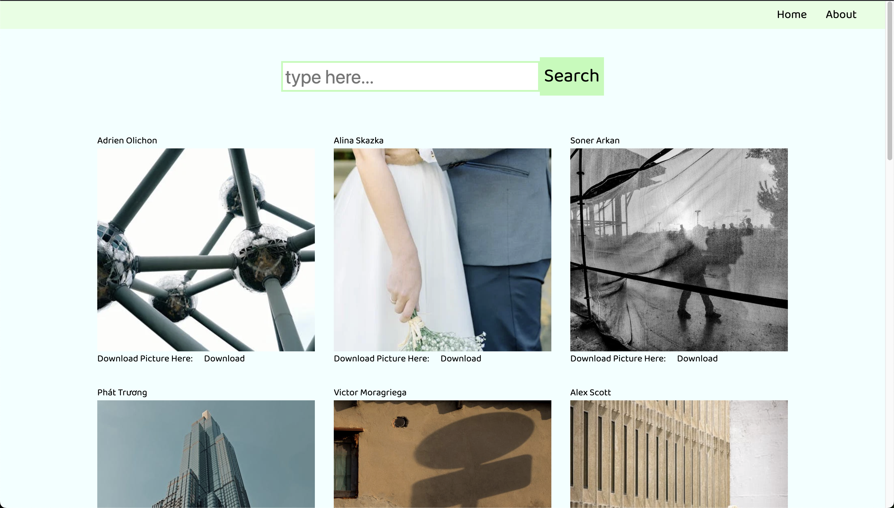
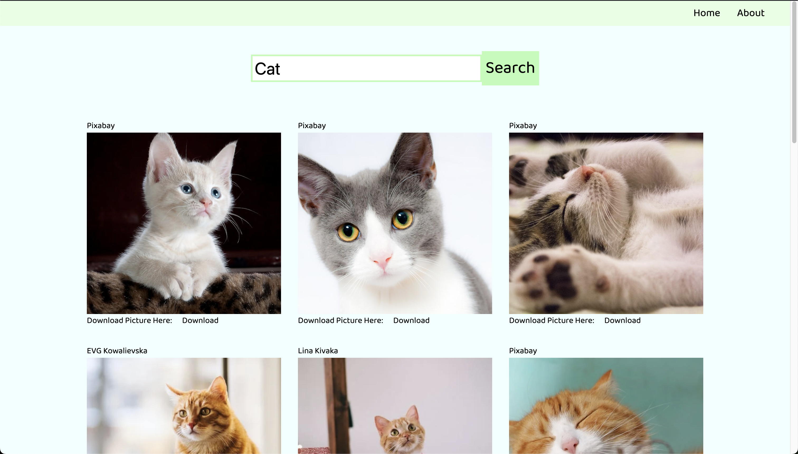
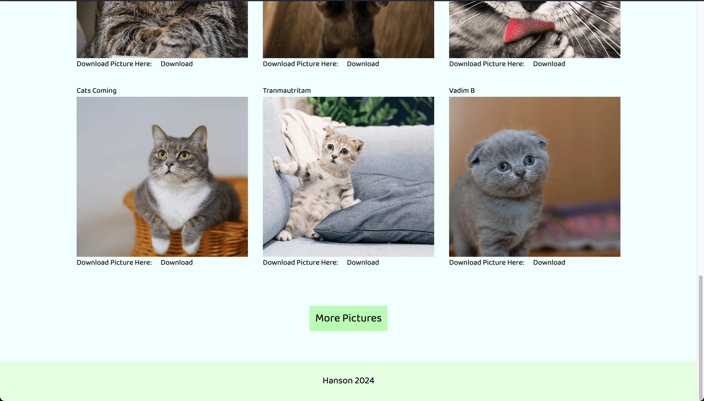
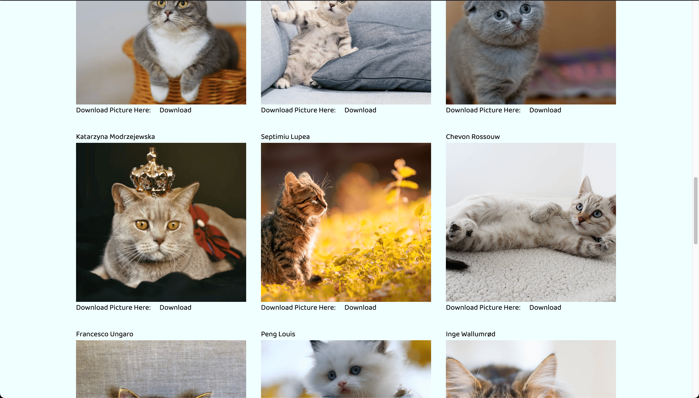

# 關於這個網站

這是一個圖片搜尋網站，使用 React 專案進行開發，這是我的首個 React 專案。 
在此專案中，我練習了使用 Axios 套件來抓取 Pexel.com 的 API 作為圖片的顯示來源。 

<h2>Demo:</h2>

一進去首頁，畫面會顯示從當下 Pexels.com 的 API 傳送的精選圖片。

使用者可以在搜尋欄中搜尋任意關鍵字，按下 Search 鍵後可以搜尋相關圖片。

滑到頁面下方，會出現一個 More Pictures 按鈕。

按下此按鈕後，可以另外再顯示 15 張圖片。

<h2>學習到的技術：</h2>

<ul>
    <li>如何開啟React專案</li>
    <li>使用react-router-dom做Page Routing</li>
    <li>使用Axios套件的get方法獲取API回傳的伺服器資料</li>
    <li>使用useState及useEffect兩種React Hooks</li>
</ul>
